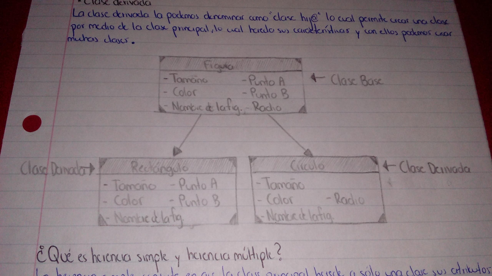

## 3. Herencia 
## ¿Qué es la Clase Base?
La Clase Base también la podemos denominar como la clase padre, la cual tiene como función la herencia de características similares a otras clases que podemos crear por medio de la herencia recibida.
## ¿Qué es la Clase Derivada?
La clase derivada la podemos denominar como "Clase Hij@", lo cual permite crear una clase por medio de la clase principal, este hereda sus características y con ellos podemos crear muchas clases.
## Haz un diagrama UML donde se muestre la relación de herencia entre las clases Figura, Rectángulo y Círculo como vimos en clase. Indica cuales son la Clase Base y las Clases Derivadas.

## ¿Qué es Herencia Simple?
La herencia simple es una relación entre una Clase Base y una Clase Hij@, es cuando la Clase Derivada que estamos considerando solo tiene una base. 
## ¿Qué es Herencia Múltiple?
La herencia múltiple son aquellos casos en los que una Clase Derivada tiene varias clases base.
## ¿En C# se puede hacer Herencia Multiple?
Sí, pero solamente por medio de interfaces, lo cual esto quiere decir que solo se pueden heredar los atributos, pero no las implementaciones.